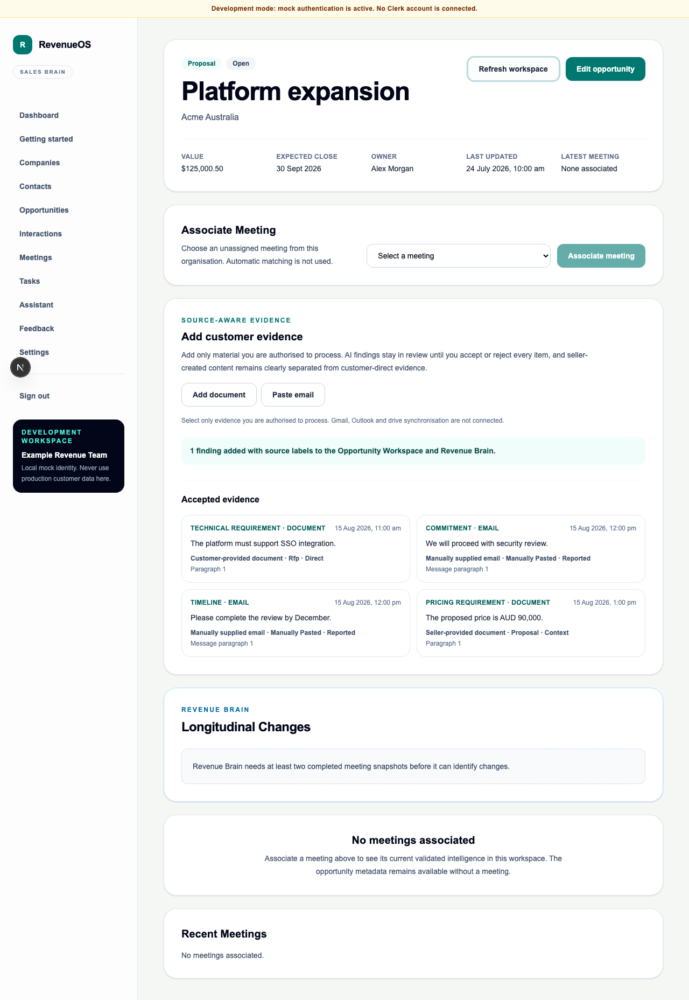

# WO-019 — Documents and Email Evidence

- **Status:** Implemented on
  `feature/epic-8-wo-019-documents-email-evidence`; merge remains a human decision.
- **Date:** 2026-08-15

## Outcome

RevenueOS now accepts deliberately selected PDF/TXT documents and manually pasted
plain-text emails as review-gated evidence for an account, opportunity and optional
Interaction. Accepted findings appear in Opportunity Workspace and the Revenue
Brain source timeline with source date, type, ownership, support classification and
precise location. No mailbox, drive or CRM integration was added.

## Delivered

- additive migration `0029_doc_email_evidence` with tenant-owned source, fragment,
  candidate and immutable Revenue Brain source-snapshot tables, composite tenant
  keys and forced PostgreSQL RLS;
- private PDF/TXT storage, bounded parsing, signed no-store downloads and object-
  first deletion;
- plain-text email normalisation with conservative quote/signature handling and
  exact Contact verification;
- deterministic no-network extraction plus strict OpenAI adapter boundary;
- explicit origin/support policy that prevents seller documents or outbound email
  from becoming customer-confirmed evidence;
- complete edit/accept/reject review, zero-finding completion and additive
  supersession links;
- responsive Opportunity Workspace ingestion/review and Revenue Brain source
  timeline;
- export v10, retention/deletion coverage, quotas, kill switches and synthetic demo
  sources; and
- API, parser, migration, RLS, service, component and browser regression coverage.

## Security and privacy boundary

Authority and external-processing acknowledgement are mandatory. Raw documents,
email bodies, addresses, prompts and provider payloads stay out of logs. Document
content is parsed locally before storage and rejected for unsupported active PDF
features, password protection, malformed structure, unsafe control content or
configured limits. Email is plain-text-only and sender identity is never inferred.

Production must use the approved private object-storage adapter. OpenAI remains
optional; mock mode is labelled and makes no network call. Deletion removes local
objects and derived lineage but cannot remove an upstream file or mailbox message
because RevenueOS has no upstream connection.

## Architecture decision

No new ADR was required. The work follows the already approved modular-monolith,
tenant repository, private storage adapter, explicit provider adapter and immutable
evidence/snapshot patterns. A future mailbox or drive connector would be a durable
new security boundary and requires its own work order and decision record.

## Out of scope

DOCX, OCR, attachments, HTML email, Gmail/Outlook/drive sync, automatic contact
creation, legal interpretation, automatic opportunity-field writes and downstream
automation remain unimplemented.

## Rollback

Disable `API_FEATURE_DOCUMENT_EVIDENCE_ENABLED` and
`API_FEATURE_EMAIL_EVIDENCE_ENABLED`, deploy the previous application, then retain the
new tables for a reversible rollback. After an approved export and data-loss
decision, downgrade Alembic from `0029_doc_email_evidence` to
`0028_online_meeting_capture`; document/email source content and lineage are
removed while existing Interaction evidence remains compatible.
