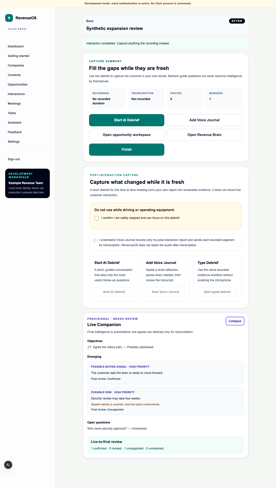

# WO-020 — Live Interaction Intelligence

## Outcome

WO-020 implements optional provisional intelligence during a supported in-progress
Interaction with an authorised progressive transcript source. The implementation is
tenant-isolated, incremental, deterministic/no-network and persisted separately from
final Interaction Intelligence.

Delivered scope:

- migration `0030_live_interaction_intel` with forced RLS, composite tenant foreign
  keys, constrained lifecycle/schema, indexes, retention and reversible migration;
- progressive/provisional transcript contract and conservative speaker roles;
- live session, server cursor, bounded processing windows, provisional signals,
  brief objective/question progress, dismissal and deterministic reconciliation;
- feature flags, source/consent boundary, quotas, metadata-only observability,
  export v11, retention and complete deletion paths;
- quiet mobile Live Companion with explicit enable/disable, collapse and dismiss;
- unresolved live/final gaps available to Debrief without copying transcript text;
- synthetic demo data plus API, migration, RLS, component and Playwright coverage.

## Architecture and safety decisions

The browser polls a bounded API; PostgreSQL owns the cursor and dedupe state. No
WebSocket, broker or second worker was added. The provider is deterministic and makes
no network request. `API_FEATURE_LIVE_INTERACTION_EXTERNAL_AI_ENABLED` remains off
and no external adapter is implemented.

Live signals never update final Opportunity Workspace intelligence or Revenue Brain.
Final evidence uses the existing normal pipeline; reconciliation annotates only the
live history as confirmed, revised, unsupported or unresolved.

## Rollback

Disable `API_FEATURE_LIVE_INTERACTION_INTELLIGENCE_ENABLED` first. Migration
`0030_live_interaction_intel` downgrade permanently removes live sessions, windows,
signals, progress and progressive transcript versions, then restores the WO-019
transcript constraints. Export/approve data loss before downgrade. Upgrade,
downgrade/re-upgrade, one-head and drift checks are covered.

## Explicit exclusions

There is no production live-transcription provider, external live AI, live coaching,
predictive scoring, CRM mutation, task/email action, ordinary cellular interception,
biometric speaker identification, meeting bot, native app, WebSocket platform,
Kafka, Redis, Celery, RabbitMQ or billing.

## Validation

The complete local gate passed on 15 August 2026:

- formatting, linting and strict type checking for the web and API;
- 133 web unit/component tests;
- 742 API tests passed and four PostgreSQL-only tests skipped because this local
  environment has no PostgreSQL server or Docker/PostgreSQL binaries;
- all 18 Playwright browser journeys;
- production web and API builds;
- migration upgrade, downgrade/re-upgrade, one-head and generated-schema drift checks;
- the fresh-database migrate and drift commands through SQLite;
- repository policy audit, Markdown link validation and diff hygiene.

The forced-RLS PostgreSQL cases and configured PostgreSQL migration command must run
in CI. They were not represented as local passes.

See the [product guide](../01-product/live-interaction-intelligence.md),
[incremental processing](../03-engineering/live-intelligence-incremental-processing.md),
[reconciliation](../03-engineering/live-intelligence-reconciliation.md) and
[security review](../03-engineering/live-intelligence-security-review.md).
