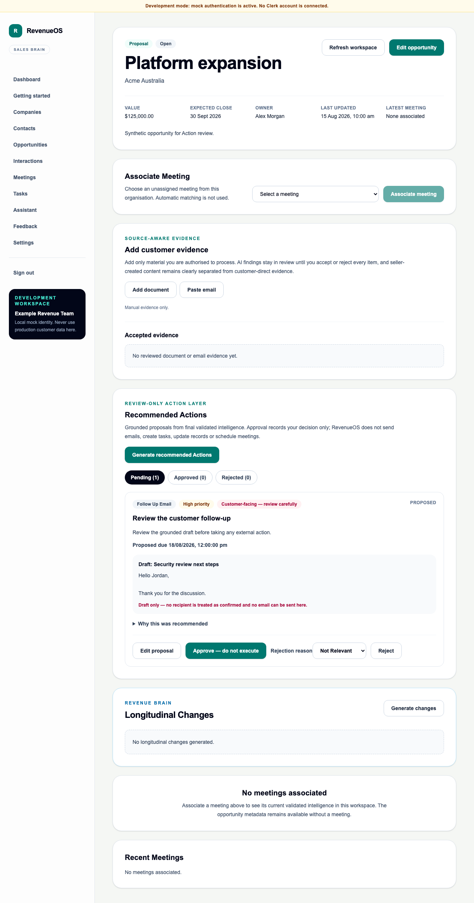

# WO-021 — Action Layer

## Outcome

WO-021 implements a tenant-isolated, review-only Action Layer over final validated
intelligence. Deterministic generation produces bounded typed proposals in the
Opportunity Workspace. Users can inspect sources, revise content, approve, reject or
manually complete safe internal work. Approval never executes externally.

Delivered scope includes migration `0031_action_layer`, strict API/shared contracts,
proposal/version/audit persistence, idempotent generation and supersession, lifecycle
validation, source revalidation, quotas/flags, Pre-Interaction Brief context, export,
retention/deletion, accessible UI and API/component/browser coverage.

## Security and tenant impact

All three tables are tenant owned, use composite tenant relationships and forced RLS.
The service reads no provisional Live Intelligence or raw transcript. Logs and audit
events are metadata-only. Customer-facing Actions are high-friction and cannot be
marked externally complete.

## Migration and rollback

Disable `API_FEATURE_ACTION_LAYER_ENABLED` to hide all Action endpoints. Disable
`API_FEATURE_ACTION_MANUAL_COMPLETION_ENABLED` independently to remove manual
completion. Downgrading to `0030_live_interaction_intel` permanently removes all
Action proposals, revisions and audit history; export required records first.

## Explicit exclusions

No email sending, CRM/calendar/task connector, autonomous loop, execution worker,
provider composition, background retry or record mutation is implemented.

## Validation

The complete local gate passed on 15 August 2026: repository policy and dependency
audits; web/API formatting, linting and strict types; 135 web tests; 748 API tests
with four PostgreSQL-only cases skipped; all 19 Playwright journeys; production web
and API builds; and fresh SQLite migration plus generated-schema drift checks.

The configured local PostgreSQL endpoint was unavailable, so forced-RLS and
PostgreSQL migration cases were not represented as local passes. They remain required
in CI.
