# WO-029 — Personalised Outreach

- **Branch:** `feature/epic-13-wo-029-personalized-outreach`
- **Status:** implemented for draft PR; production mailbox deliberately deferred
- **Migration:** `0038_personalized_outreach`
- **Product boundary:** RevenueOS Engage one-to-one canonical Contact email

## Outcome

WO-029 adds the smallest trustworthy path from Contact to a reviewed, source-backed
personalised email and deterministic simulation:

`Contact → purpose → generated draft → source disclosure → edit → approve → exact preview → explicit simulation`

Engage has its own organisation entitlement and administrator policy. Prospect-only
organisations cannot use it. The workflow uses current Contact, Company, Prospect
research, Contact field provenance, Action and Execution records rather than creating
parallel lead/contact or sender models.

## Delivered

- four explicit outreach purposes;
- bounded deterministic composition from eligible company/person professional
  research and approved seller offering/value/CTA;
- transparent no-reliable-hook copy when research cannot safely personalise;
- immutable outreach/source revisions and matching Action revisions;
- edit-invalidates-approval lifecycle;
- separate address trust, permission and server contactability states;
- organisation policy for outbound enablement, provider-supplied address use,
  cooldown, daily limits, opt-out requirement and approved seller context;
- organisation-scoped HMAC suppression with Contact-delete/re-discovery continuity;
- canonical Contact and authenticated user-bound sender enforcement;
- exact From/To/subject/body preview and distinct confirmation;
- deterministic Mock Email simulation outside production through WO-022 execution;
- execution idempotency and revalidation at preview, confirmation and worker;
- metadata-only audits/logs and outbound seller-activity/Evidence separation;
- RLS, retention, export and organisation/Contact deletion coverage;
- responsive Contact workspace, Engage Settings, component and Playwright flows; and
- provider evaluation with Gmail/Microsoft production adapters deferred.

No real external email is sent by this work order. No paid service was activated.

## Synthetic demo

Development seeds the Engage entitlement, approved policy and a user-bound Mock Email
connection. The flagship Prospect fixture is entirely synthetic:

- **Company:** Northstar Facilities Group
- **Contact:** Jane Smith, Chief Information Officer
- **Address:** provider-supplied business email
- **Sources:** Australian expansion and public technology-consolidation context
- **Offering:** Multi-site Access Management
- **Purpose:** request a meeting

The expected draft uses both cited professional sources, stays concise and shows the
offering/CTA approved by the organisation. Browser fixtures also cover a Contact with
no reliable hook, an active do-not-contact block and mobile layout. API tests cover
suppression surviving Contact deletion and cross-organisation denial. Fixtures use no
real people or addresses.

The backend contactability state model also covers no/unknown email, policy missing,
provider-supplied blocked, suppression reasons, cooldown, quotas, entitlement and
disabled sender. Unknown delivery remains a reserved future-provider state; it is not
fabricated by the deterministic mock.

## Screenshots

The screenshots use only the synthetic development fixtures described above.

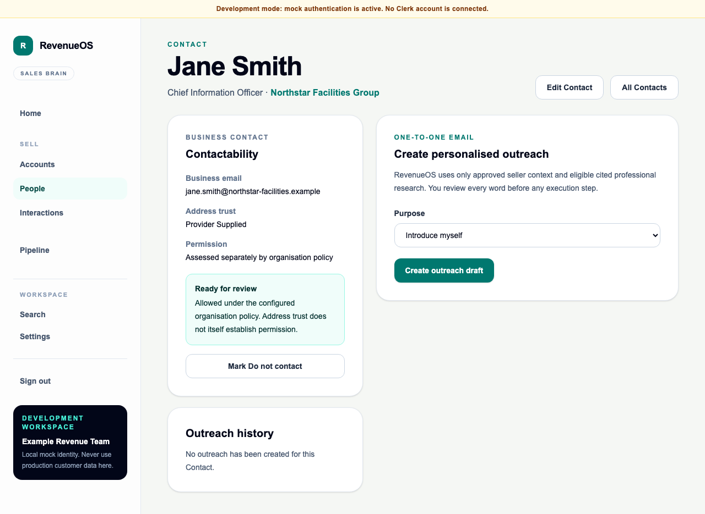

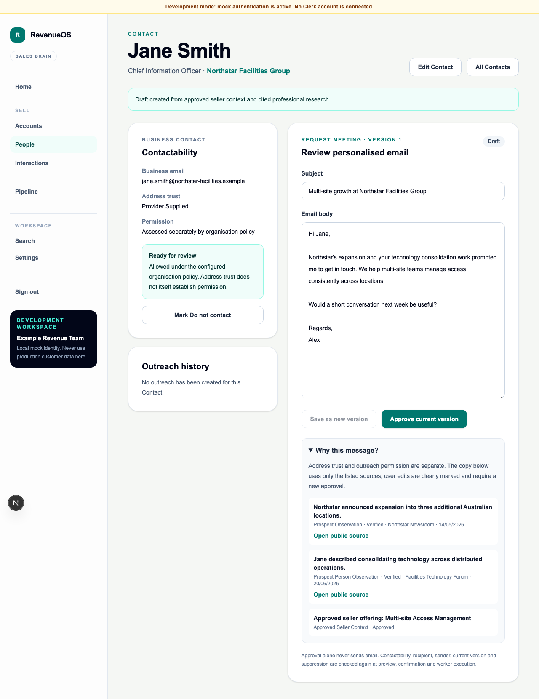

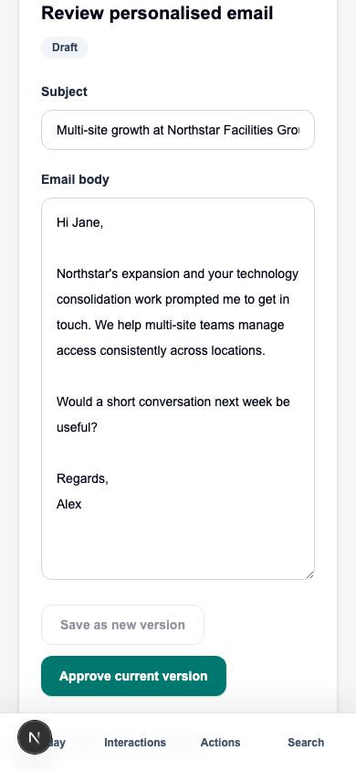

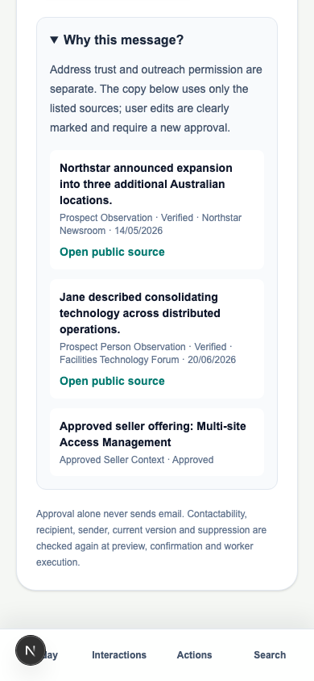

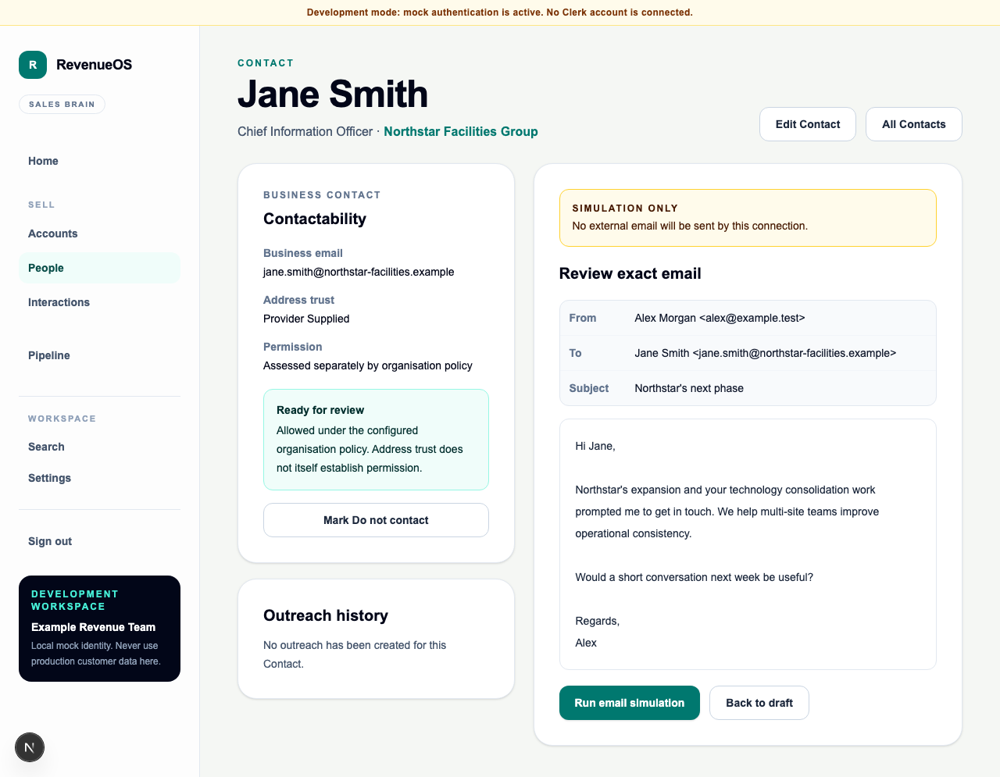

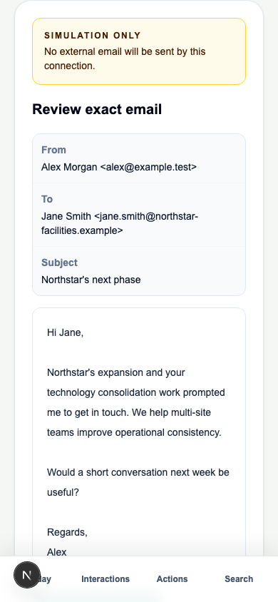

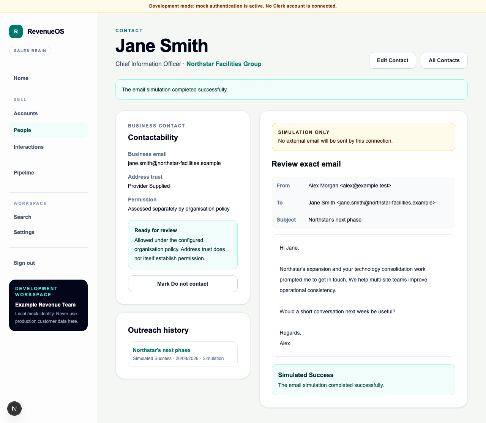

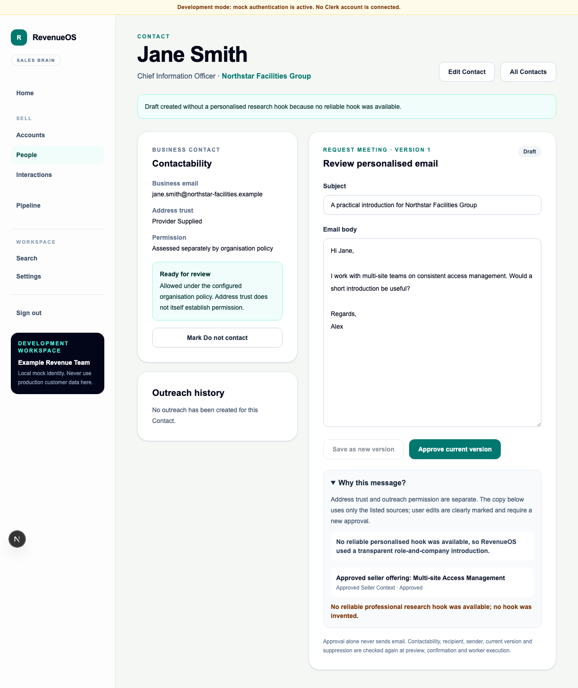

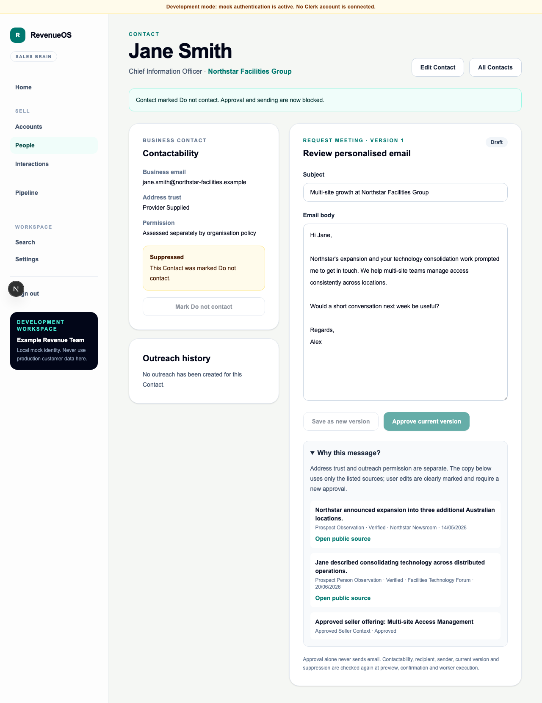

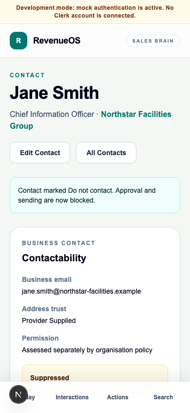

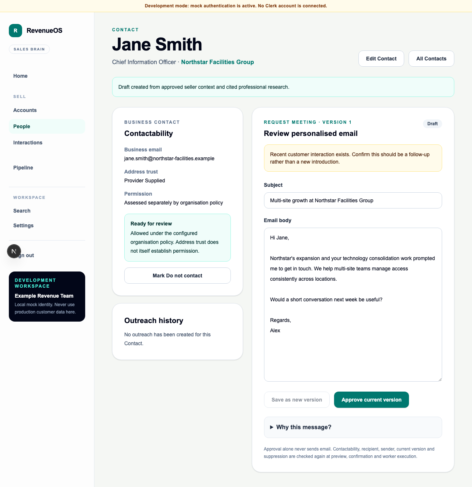

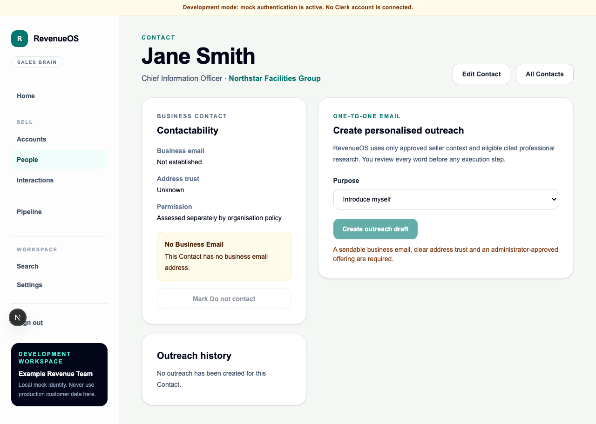

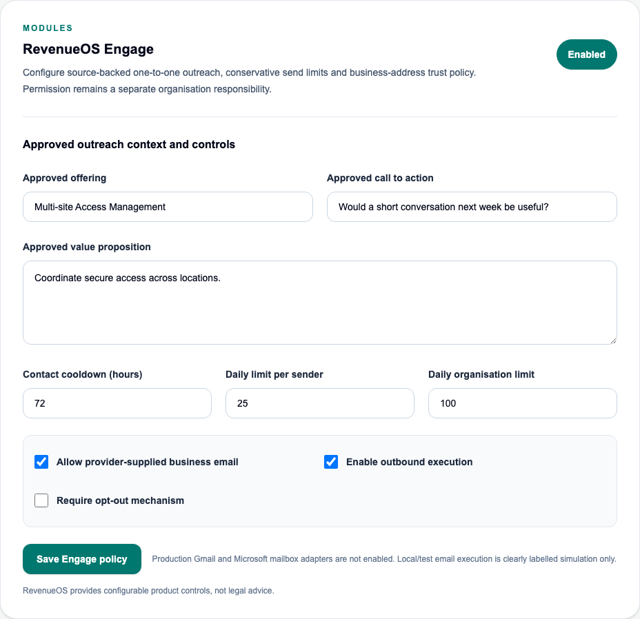

## Architecture decisions

- Recipient is a canonical Contact; no arbitrary address contract.
- Sender is the authenticated user's active connection; no From injection.
- Address verification/provenance is never interpreted as permission.
- Personalisation sources are chosen and persisted server-side.
- No free-form AI provider is used in this slice; provider fabrication is therefore
  impossible at the composition boundary.
- Approval is review only. Confirmation is separate and revalidated.
- Suppression uses HMAC identity and is not erased with ordinary Contact deletion.
- Gmail and Microsoft Graph remain evaluated future adapters, not stubs described as
  integrations.
- There is no scheduled sending, automatic retry, reply sync or HubSpot activity
  logging. A future provider must safely reconcile ambiguous acceptance.

See the [product guide](../01-product/personalised-outreach.md),
[UX review](../02-design/personalised-outreach-ux.md),
[architecture](../03-engineering/personalised-outreach-architecture.md),
[security review](../03-engineering/personalised-outreach-security-review.md),
[mailbox evaluation](../05-integrations/mailbox-provider-evaluation.md) and
[ADR 0043](../08-decisions/0043-review-first-one-to-one-outreach-and-deferred-mailbox.md).

## Verification scope

Tests cover flagship source selection/versioning/approval/exact simulation and
idempotent double confirmation, no customer Evidence mutation, suppression and
Contact deletion, tenant isolation, migration constraints/immutability/cycle,
responsive UI, no-hook disclosure, policy configuration and suppression rejection.
The completed repository gate passed formatting, lint and static types; 908 API tests
passed with four intentionally skipped; 178 Vitest tests passed; 44 Playwright tests
passed; both PostgreSQL RLS tests passed; all 13 migration tests passed with one
environment-dependent migration test intentionally skipped; Alembic reached head and
reported no schema drift; and both web and API builds passed. The repository audit
and production JavaScript dependency audit also passed.

## Out of scope and WO-030/031 handoff

No campaign, sequence, bulk/CSV recipient, mass personalisation, autonomous follow-up,
scheduling, LinkedIn/call automation, inbox, tracking pixel, click tracking,
predictive timing, inferred recipient, arbitrary SMTP, second mailbox provider,
Event Intelligence or new queue infrastructure was added.

WO-030 owns any campaign/sequence orchestration and must preserve per-Contact
suppression, per-person exact rendering/review, quotas, idempotency and provider
reconciliation. WO-031 owns Event Intelligence. Neither is authorised by WO-029.

## Rollback

Disable the `engage` entitlement/feature before rollback so new drafts and execution
fail closed. Cancel unsent simulation executions, then downgrade migration 0038 to
0037 if data loss for the new outreach/policy/suppression tables is explicitly
accepted. Database and application should be rolled back together. Downgrade cannot
unsend external email, although this work order has no production email adapter.
