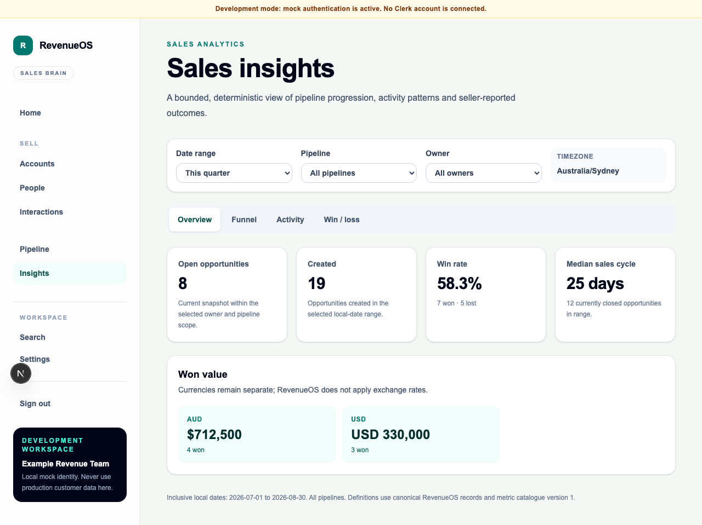
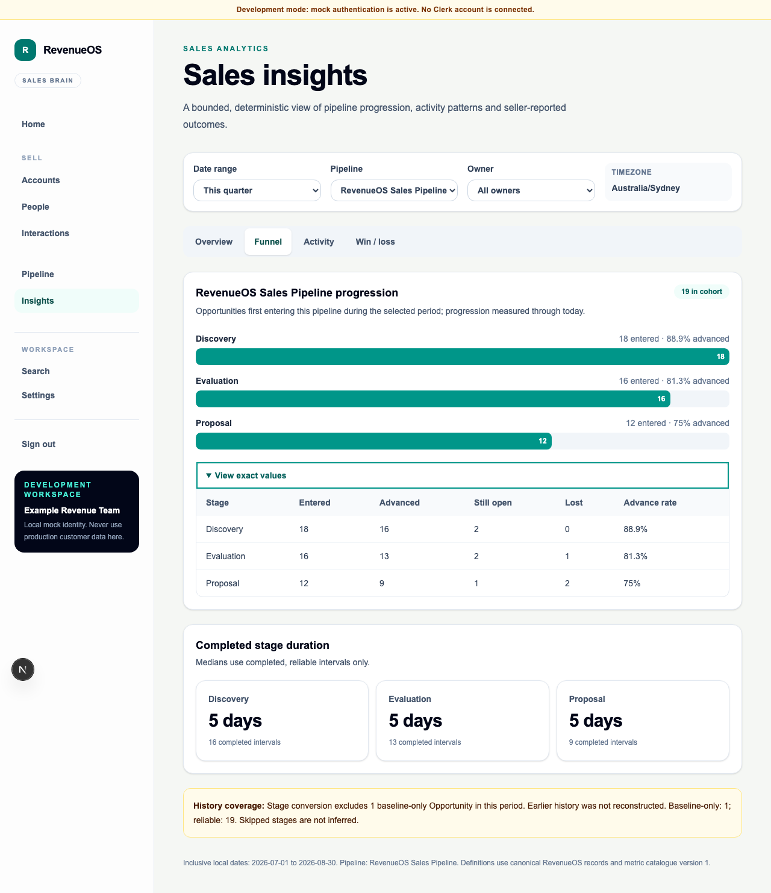
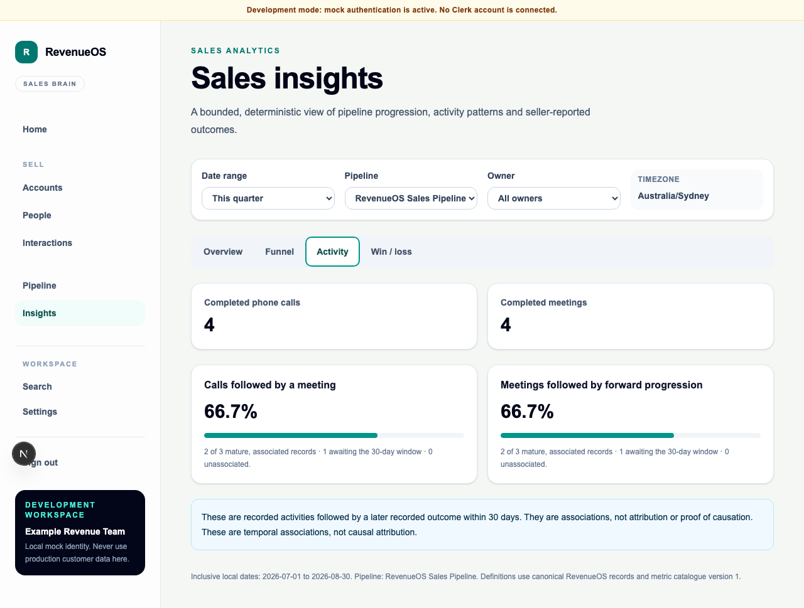
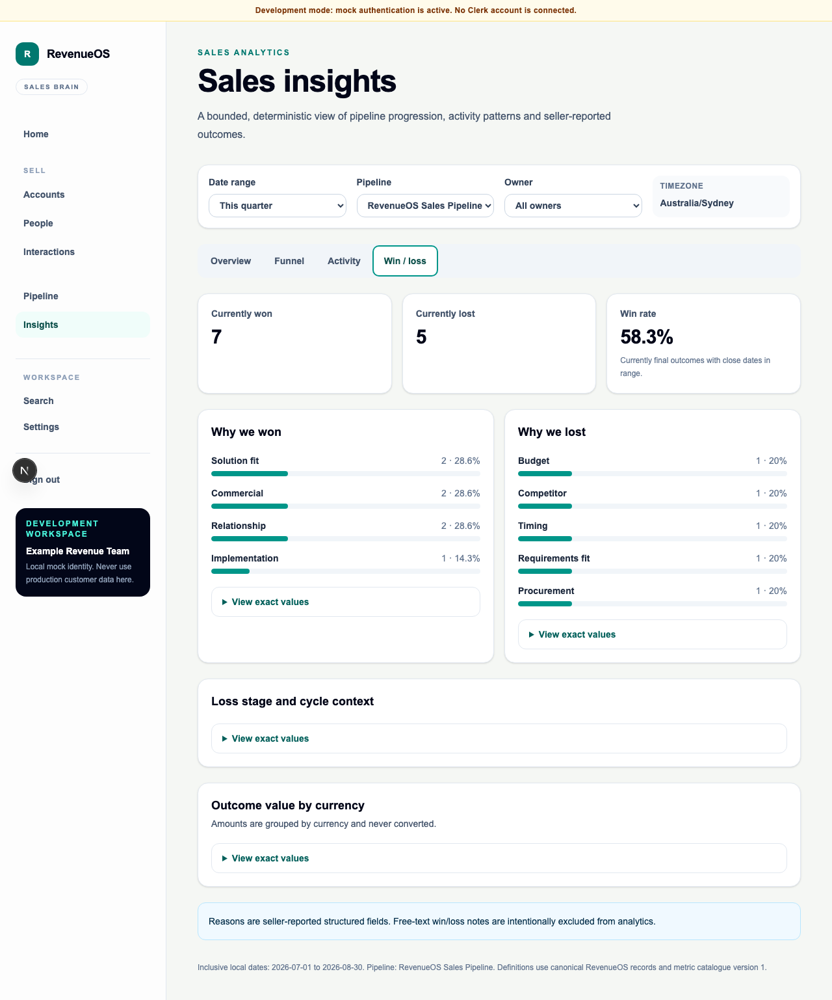
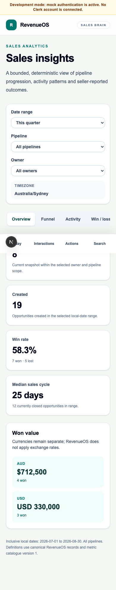

# WO-036 — Sales Analytics and Win/Loss Intelligence

**Status:** implemented on `feature/epic-16-wo-036-sales-analytics-win-loss`; draft
pull request required; not merged.

## Delivered

- an inspectable version-1 canonical metric registry and reusable scalar
  `SalesMetricService` handoff for WO-037;
- strict tenant-scoped metadata, metric, Overview, Funnel, Activity and Win/Loss APIs;
- inclusive timezone-aware filters, current-owner/pipeline semantics, current-final
  outcome/reopen handling and currency separation without FX;
- actual-entry funnel cohorts, no fabricated skipped stages, explicit baseline
  coverage and reliable completed stage-duration samples;
- canonical call/meeting counts plus mature 30-day non-causal follow-on rates;
- confirmed-live Outreach counting that excludes simulation and non-success states;
- seller-reported controlled Win/Loss reasons, loss-stage/cycle/value context and
  deliberate exclusion of free-text closure notes;
- an accessible responsive Insights page with four views, exact tables, safe states
  and desktop navigation;
- migration `0045_sales_analytics` containing four bounded query indexes only;
- 20 fixed synthetic Opportunities with canonical histories, Won/Lost/open/reopened,
  mixed currency and incomplete baseline cases, plus eight canonical activities;
- product, UX, metric, architecture, security/privacy and ADR documentation.

## Deliberate boundaries

No analytics fact copy, warehouse, queue, cache, generic BI/report/query builder,
text-to-SQL, custom formula, open/click tracking, employee leaderboard, rep score,
productivity surveillance, probability, weighted pipeline, forecast, benchmark,
manager coaching, new AI/provider or mutation of Evidence, Methodology or Revenue
Brain was added. Sales Analytics is Core and uses one rollout flag only.

## Known limitations

Results are only as complete as RevenueOS-recorded canonical history. Pre-WO-035
timing and unrecorded external CRM changes are unavailable. Owner filters use current
Opportunity owner rather than event-time credit. Reasons are seller-reported, and
follow-on activity is association rather than causation. Reply analytics, qualitative
Win/Loss AI, arbitrary segmentation, cross-currency conversion, targets, forecast and
manager surfaces remain later work.

## Validation

Unit/integration coverage reconciles DST date boundaries, outcome/reopen and currency
rules, funnel skip/regression/baseline behaviour, duration samples, 30-day maturity,
tenant filter denial, registry uniqueness and safe note exclusion. Web coverage tests
all four views, exact values, disclosures, filter behaviour, retry state and navigation.

The complete local gate passed: Prettier, ESLint, TypeScript, 206 Vitest tests,
58 Playwright tests, the Next.js production build, Ruff, mypy across 217 source
files, 991 pytest tests with four expected skips, PostgreSQL migration upgrade and
drift check, Python package build and the repository audit. Playwright verified the
final desktop and 390-pixel layouts and generated the evidence below.

## Visual evidence

### Overview

### Funnel

### Activity and Win/Loss

### Mobile

The complete evidence set also includes mobile Funnel, Activity and Win/Loss views
plus the deliberate empty state in this work-order asset directory.
