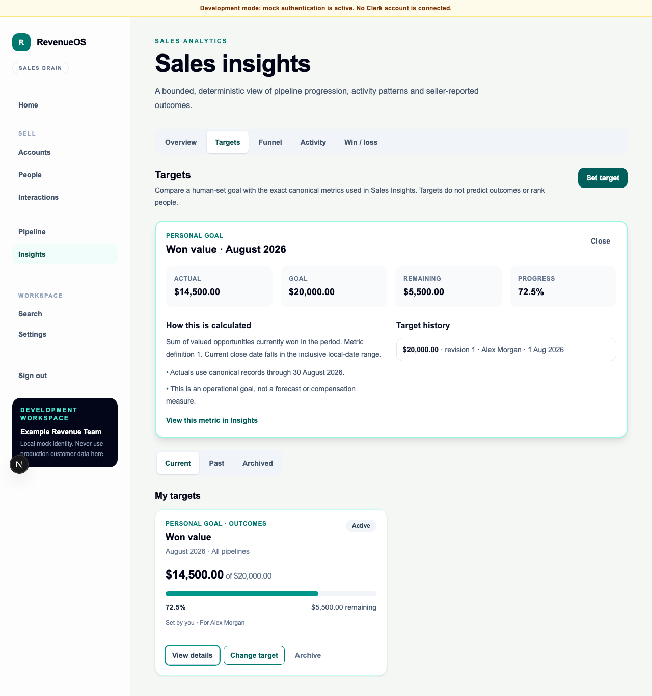
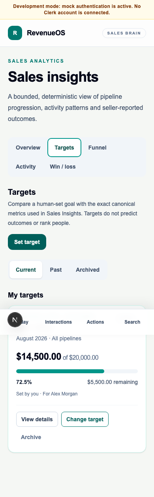

# WO-037 — Targets & KPI Engine

**Status:** Implemented on `feature/epic-16-wo-037-targets-kpi-engine`; draft pull
request and final CI evidence are recorded at hand-off. No merge is authorised by
this work order.

## Outcome and scope

WO-037 adds RevenueOS Core Targets without expanding into forecast, manager
intelligence, compensation, ranking, AI or automation. It reuses the exact WO-036
metric registry and `SalesMetricService`, adds explicit-period configuration plus
append-only revisions, and exposes live progress in Insights.

Implemented:

- exactly five targetable higher-is-better metrics: Won value, Closed Won count,
  Opportunities created, Meetings completed and Calls completed;
- self-set personal, administrator-assigned personal and organisation targets with
  distinct authority/visibility;
- monthly, calendar-quarter and calendar-year records using an immutable
  organisation-timezone snapshot;
- optional tenant-owned Pipeline for Opportunity metrics and one required currency
  for Won value, with no FX;
- current/full-period live canonical actuals, future **Upcoming**, exact remaining or
  above target, and uncapped percentages;
- optimistic append-only goal revisions, current/future archive and locked past;
- canonical correction/reopen/reassignment behaviour with no persisted actual;
- member-deactivation archive, limits, metadata-only audit, export schema 26 and
  retention/deletion integration;
- an Insights Overview summary, dedicated responsive Targets tab, explanation,
  history and explicit empty/loading/error/unavailable states; and
- deterministic 2026 demo target records plus desktop/mobile browser evidence.

Deliberately excluded: rate/lost/duration/outreach targets, custom formulas, fiscal
calendars, recurrence/jobs, weekly/rolling periods, bulk quotas, target imports, team
hierarchy, manager role/roll-up, individual contribution views, primary targets,
Daily changes, notifications, pacing/on-track, prediction, forecast, leaderboard,
gamification, compensation, target-triggered Actions and AI.

## Domain, schema and API

Migration `0046_sales_targets` adds `organisations.timezone`, `sales_targets` and
`sales_target_revisions`, active-identity uniqueness, forced RLS, composite tenant
foreign keys and PostgreSQL immutability triggers. API readiness now expects this
head. OpenAPI exposes metadata/list/create/detail/revise/archive under
`/api/v1/targets`; shared TypeScript contracts were updated in the same change.

The current target goal is the highest append-only revision. Actual is never accepted
from the client, exported as a snapshot or stored as a counter. The server passes
period, timezone, supported Pipeline, current-owner/creator and currency filters to
`SalesMetricService.observe`, then calculates display arithmetic only.

## Permissions and privacy

Self-set is owner-managed; assigned/organisation is administrator-managed. Assigned
owners are read-only. Administrators can read, but cannot revise/archive, another
person's self-set goal. Ordinary peers cannot read or infer a personal target even
inside one tenant; organisation aggregate targets are shared. The admin configuration
list sorts by person/period rather than attainment and contains no ranking.

## Quality evidence

Focused API tests cover allow-list policy, rate/outreach exclusions, canonical
AUD/USD reconciliation, no-FX, exact 14.5k/20k/5.5k/72.5% arithmetic, progress above
100%, self/assigned coexistence, duplicate rejection, peer privacy, all authority
paths, client-actual rejection, period/timezone/future behaviour, immutable history,
archive/past lock, correction/reopen, deactivation and feature gating. Migration
tests cover upgrade/downgrade, schema and active identity; the PostgreSQL integration
suite includes both new forced-RLS tables and revision immutability. Export coverage
proves goal history is present and actual is absent.

Web tests cover Overview integration, all five tabs, exact above-100 text with a
safely capped visual bar, create payload ownership, revision confirmation/history,
detail disclosures, filtered Insights deep links, safe errors and responsive
navigation. Playwright validated the desktop and 390-pixel experiences:

## Local validation

The final post-review local gate passed on 30 August 2026:

- `pnpm format`, `pnpm lint`, `pnpm typecheck` and `pnpm build:web`;
- `pnpm test`: 58 files and 212 tests passed;
- `pnpm test:e2e`: 60 Chromium tests passed;
- `pnpm api:lint`, `pnpm api:format`, `pnpm api:typecheck` and `pnpm build:api`;
- `pnpm api:test`: 1,005 passed and 4 environment-dependent PostgreSQL tests
  skipped, with the existing Starlette/httpx deprecation warning;
- `pnpm api:migrate` and `pnpm api:migration:check`: upgrade succeeded and no
  schema drift was detected; and
- `pnpm audit`: no known vulnerabilities found.

## Handoffs

WO-038 must build a separate, versioned forecasting contract with explicit ranges,
assumptions, calibration and safe unavailable behaviour. Target progress or a gap is
not probability and no target actual is frozen for forecast input.

WO-039 must first establish manager/team authority and then preserve this work
order's no-peer/no-ranking boundary. Admin is not silently treated as a manager,
organisation progress does not expose contribution and activity remains supporting
context.
